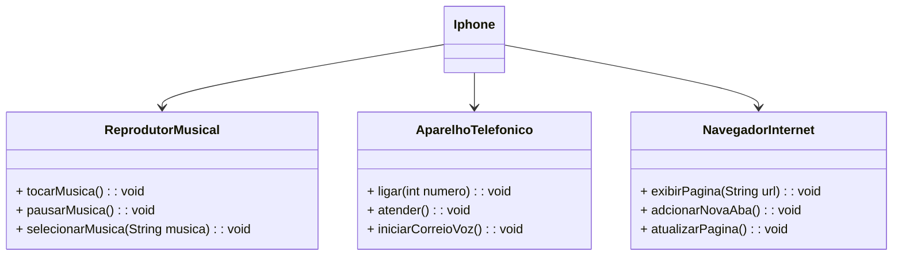

```mermaid
classDiagram
    class ReprodutorMusical {
        + tocarMusica(): void
        + pausarMusica(): void
        + selecionarMusica(String musica): void
    }

    class AparelhoTelefonico {
        + ligar(int numero): void
        + atender(): void
        + iniciarCorreioVoz(): void
    }

    class NavegadorInternet {
        + exibirPagina(String url): void
        + adcionarNovaAba(): void
        + atualizarPagina(): void
    }

    class Iphone {
    }

    Iphone --> ReprodutorMusical
    Iphone --> AparelhoTelefonico
    Iphone --> NavegadorInternet
```